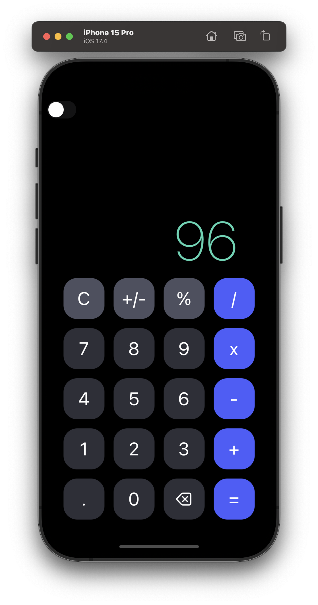
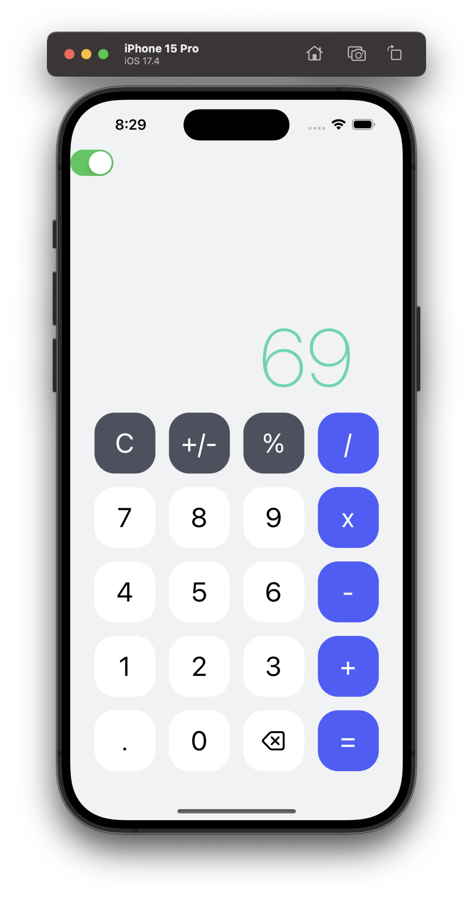

# 📱 Calculator App (React Native + TypeScript)

A simple calculator app built using **React Native** and **TypeScript**.  
Performs basic arithmetic operations with a clean and minimal UI.


## 🚀 Features

- ➕ Addition, ➖ Subtraction, ✖️ Multiplication, ➗ Division  
- 🧮 Handles decimals correctly  
- 🧼 Clear / Reset function  
- 📱 Responsive and lightweight design  
- ⚡ Built for both Android and iOS


## 📸 Demo / Screenshots

<!--  -->
<p align="center">
  
  
</p>

---

## 🛠️ Getting Started

### Prerequisites

Make sure you have the following installed:

- [Node.js](https://nodejs.org/) (v14 or higher)  
- [npm](https://www.npmjs.com/) or [yarn](https://yarnpkg.com/)  
- React Native environment set up ([React Native Docs](https://reactnative.dev/docs/environment-setup))

---

### Installation

```bash
# Clone this repository
git clone https://github.com/guruprasadhj/calculator-app-RN.git

# Navigate into the folder
cd calculator-app-RN

# Install dependencies
npm install
# or
yarn install
```

### Running the App
#### For Android:

```bash
npx react-native run-android
```
#### For iOS:

```bash
npx react-native run-ios
```

#### Start the Metro bundler:
```bash
npx react-native start
```

---
## 🧭 Usage

It so funny to write instruction for a simple calculator 😂 LOL!
Anyway
- Tap numbers (0–9) to enter digits
- Tap . for decimals
- Tap operators (+, -, ×, ÷) to perform operations
- Tap = to see the result
- Tap C to clear the current input

## 📁 Project Structure

```bash
calculator-app-RN/
├── assets/           # Images, icons, etc.
├── src/              # Source files
│   ├── components/   # UI components
│   ├── context/      # Theme Context 
│   └── styles/       # Styles 
├── App.tsx           # Root component
├── package.json
├── tsconfig.json
└── app.json
```

## 💻 Author

Guru Prasadh J